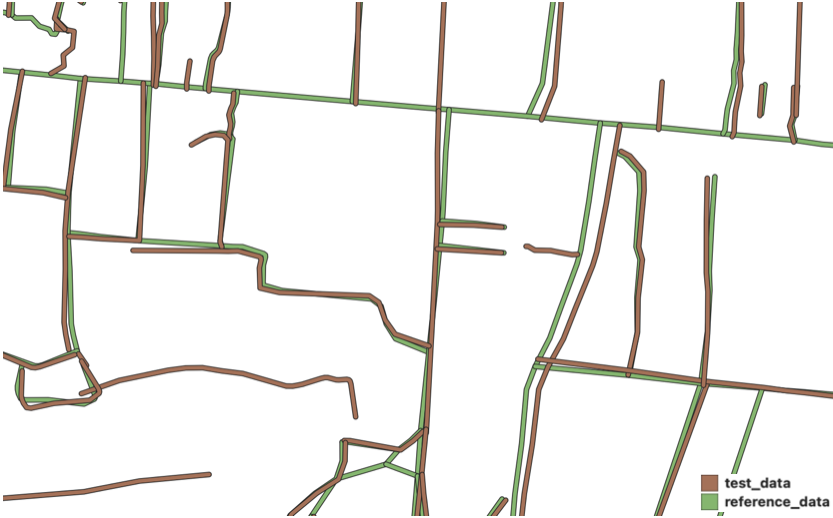
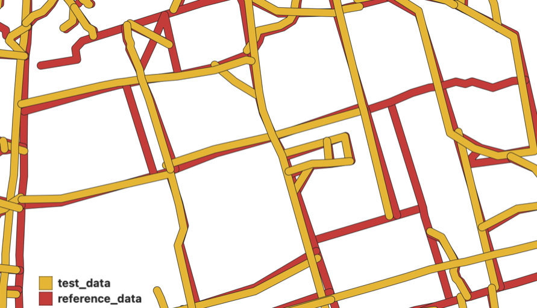
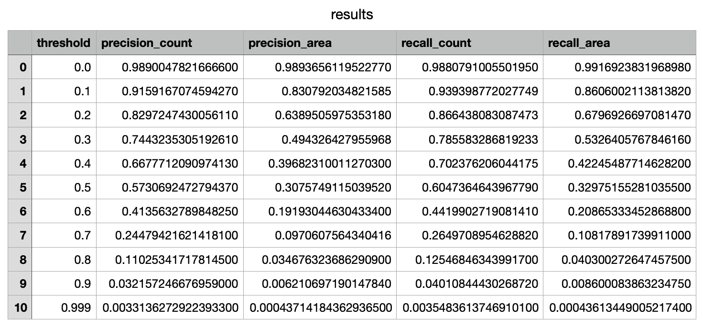
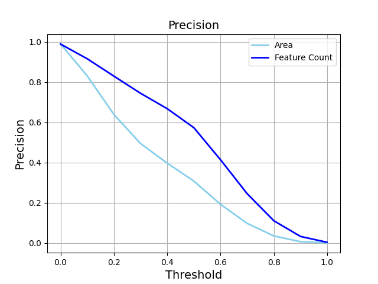
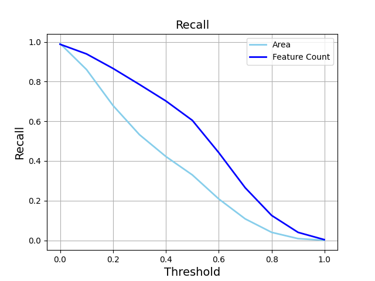
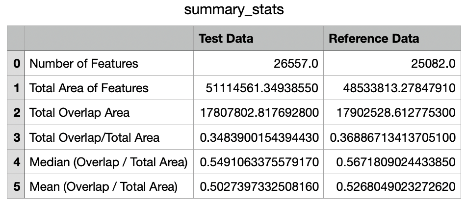

## Foundation Data Evaluation (FDE)
A function to approximate precision and recall for a test road network when compared to a reference road network. FDE can account for geo-registration errors when the road network comes from different imagery or human variations of extraction.

### Origin
FDE was developed at the National Geospatial-Intelligence Agency (NGA) by a federal government employee in the course of their official duties, so it is <strong>not</strong> subject to copyright protection and is in the public domain in the United States. 

You are free to use the core public domain portions of FDE for any purpose. Modifications back to the cores of any dependency functions are subject to the original licenses and are separate from the core public domain work of FDE. 

### Transparency
NGA is posting code created by government officers in their official duties in transparent platforms to increase the impact and reach of taxpayer-funded code. NGA is also posting FDE to give NGA partners insight into how foundation data is quality controlled within NGA to help partners understand parts of quality assurance checks.

### Pull Requests
If you'd like to contribute to this project, please make a pull request. We'll review the pull request and discuss the changes. This project is in the public domain within the United States and all changes to the core public domain portions will be released back into the public domain. By submitting a pull request, you are agreeing to comply with this waiver of copyright interest. Modifications to dependencies under copyright-based open source licenses are subject to the original license conditions.

### Dependencies
Geopandas

Pandas

Tkinter

Matplotlib

Pygeos

### roads_eval.py

#### Methodology:

1. The user chooses two road datasets - one test road network and one reference network. File types allowed include shp, geojson, gpkg, gdb, and csv.
2. The user is asked for a road buffer. Submissions should be integers with a recommended 5 meters (so roads are buffered to 10m wide) if both road networks have been extracted from the same imagery or 10 meters (so roads are buffered to 20m wide) if the road networks have been extracted from different imagery. This difference is to account for georegistration issues.
3. The last input is for a folder to save the output files.
4. The script will reproject the crs to WGS84 Pseudo-Mercator (epsg:3857) to get the units into meters and then buffer the networks to the users specification.
5. The script then creates a geodataframe with all of the intersecting polygons between the test and reference datasets.
6. To calculate precision: The intersection polygons are grouped by test set feature. For each test feature, the proportion of intersection area against test feature area is calculated. Precision is calculated at every threshold (0.0, 0.1, 0.2, ..., 0.99) as (# of features with intersection area proportion > threshold) / (total test feature count) and (area of features with intersection area proportion > threshold) / (total test feature area).
7. To calculate recall: The intersection polygons are grouped by reference set feature. For each reference feature, the proportion of intersection area against reference feature area is calculated. Recall is calculated at every threshold (0.0, 0.1, 0.2, ..., 0.99) as (# of features with intersection area proportion > threshold) / (total reference feature count) and (area of features with intersection area proportion > threshold) / (total reference feature area).

The example below shows a reference and test example buffered at 5 meters. 

Another example shows a reference and test example buffered at 10 meters. 

#### Outputs:

1. results.csv : For each threshold [0.1, 0.2, .., 1.0], precision by feature count, precision by feature area, recall by feature count, and recall by feature area are given in a table.

2. test_data.geojson is the buffered test road network with additonal columns : area, overlap_area (area of intersection with reference set), and prop = overlap_area / area. These columns are used to calculate precision.
3. reference_data.geojson is the buffered reference road network with additional columns : area, overlap_area (area of intersection with test set), and prop = overlap_area / area. These columns are used to calculate recall.
4. precision.png - graph of the precision by feature area and feature count from results.csv

5. recall.png - graph of the recall by feature area and feature count from results.csv

6. summary_stats.csv provides feature count, feature area, total overlap / total area, median(overlap area / total area), mean (overlap area / total area) for both datasets.

#### To run the code:
1. Create virtual environment: python3 -m venv /loc/to/venv
2. Activate the virtual environment: source /loc/to/venv/bin/activate
3. Clone repo git clone https://github.com/ngageoint/foundation_data_evaluation.git
4. pip3 install -r foundation_data_evaluation/requirements.txt
5. python3 foundation_data_evaluation/roads_eval.py
